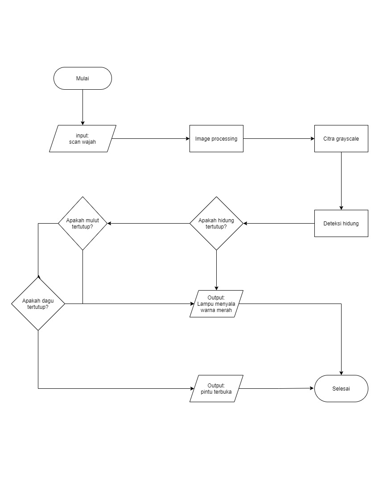

# Semester 5 Kelompok 3 Golongan A

## Nama Aaggota:

| ID GitHub         | Nama                | NIM       |
| :---------------- | :------------------ | :-------- |
| SyuagiSA          | Syaugi Salim Amar   | E41190510 |
| wahyudianpratiwi1 | Wahyu Dian Pratiwi  | E41190280 |
| henrymurdifululya | Henry Murdiful Ulya | E41190654 |
| syaiifudin        | Moh. Syaifudin      | E41190532 |

 

## Dosen Pembimbing

| Nama Workshop   | Nama Dosen                     |
| :-------------- | :----------------------------- |
| Sistem Tertanam |                                |
| Sistem Cerdas   | Ratih Ayuninghemi, S.ST, M.Kom |
| PCV             | Dia Bitari, S.ST, M.Tr.Kom.    |

 

## Platform:

| JENIS            | BAHASA PEMROGRAMAN | Contributor         |
| :--------------- | :----------------- | :------------------ |
| Image Processing | Matlab             | Moh. Syaifudin      |
| AI               | Python             | Henry Murdiful Ulya |
| Arduino          | C                  | Wahyu Dian Pratiwi  |
| Web              | ExpressJs          | Syaugi Salim Amar   |

 

## Alat dan Bahan:

1. Arduino Uno SMD
2. Kamera ESP32
3. Selenoid lock door
4. Relay 2 channel
5. Kabel jamper
6. Beardboard
7. Led hijau
8. Led merah
9. Battery 12V
10. Tempat battery 12V
11. Buzzer

 

# [Trello](https://trello.com/b/U1HF0T76/project-akhir)

 

## Flowchart

